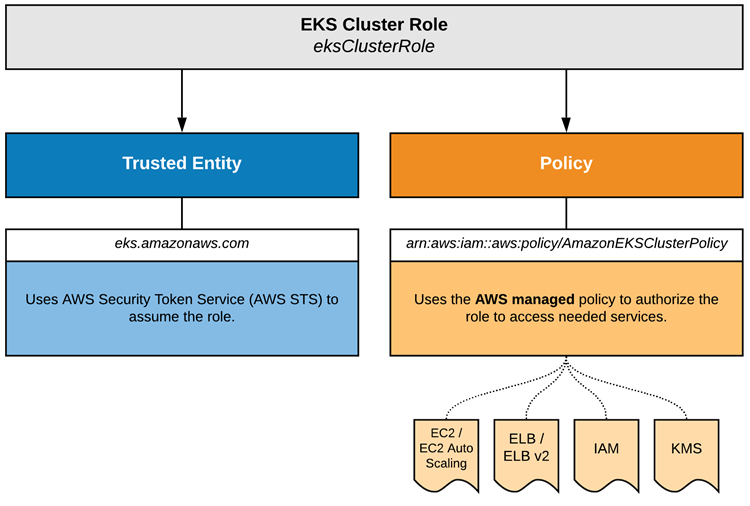
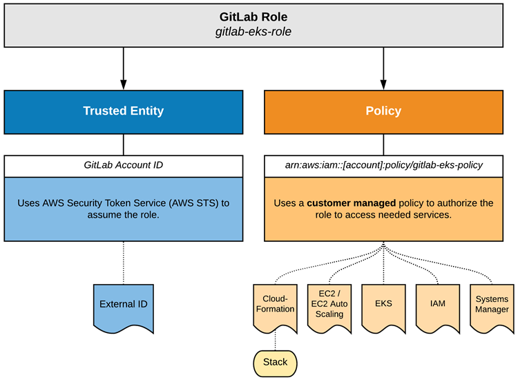

# Elastic Kubernetes Service (EKS) Cluster for GitLab CI Runners

Configures an Amazon Elastic Kubernetes Service (EKS) cluster for GitLab CI runners using Terraform.

## Amazon EKS Cluster Service Role

The `main.tf` file configures an Amazon IAM Role and attaches the `AmazonEKSClusterPolicy`. This allows the deployment of one or more EKS Clusters into your AWS account as documented [here](https://docs.aws.amazon.com/eks/latest/userguide/service_IAM_role.html).

> Check out [this video](https://youtu.be/JXDSxKt72bE) to see the process in action!

Below is a diagram showing how the EKS cluster service role works:

## GitLab Cross-Account Role

The `gitlab.tf` file configures an Amazon IAM Cross-Account Role that allows GitLab to deploy and manage an EKS cluster for CI runners to execute pipeline jobs.

> Note: You can remove the `gitlab.tf` file, and related variable configurations, if you only wish to deploy the EKS Cluster Service Role without using GitLab.

Below is a diagram showing how the GitLab cross-account role works:

